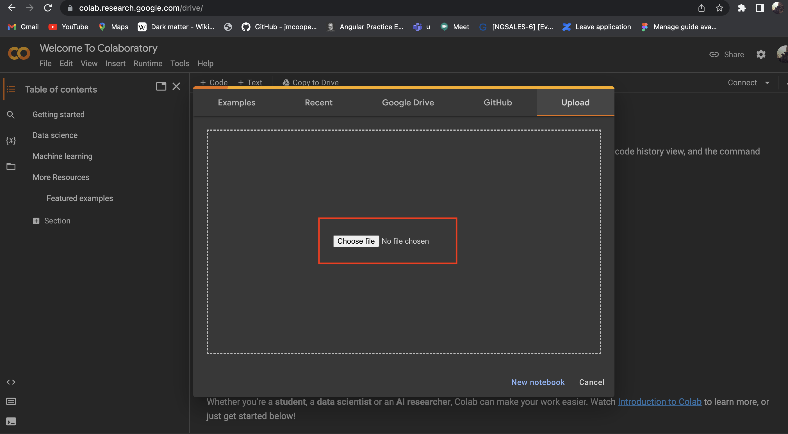
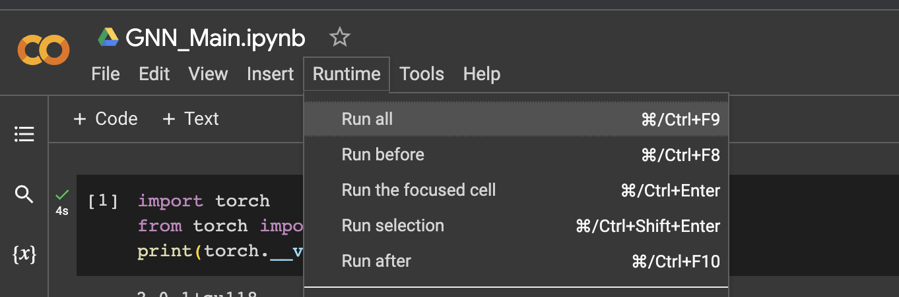

# Introduction

This repository contains code where we used the GraphSAGE approach to train our model and use CaptumExplainer to explain feature importance for edge labels. To setup the running the code please follow the steps mentioned below in the Setup section. More detailed report about the project can be found here [thesis.pdf](./report.pdf).

## Dataset

We are using IMDB dataset for our model training. IMDB is a hetrogenous graph containing three types of entities namely:- movies, actors and directors. 

## Requirement
Please refer to [requirements.txt](./requirements.txt).

## Setup
Please follow below mentioned steps to check the implementation and results for the code
- Download the python file [GNN_Explainabilty.ipynb](./GNN_Explainabilty.ipynb).
- Follow this link https://colab.research.google.com/drive/ and go to upload section and click on choose file as shown in the below image.

  

- Upload the download [GNN_Explainabilty.ipynb](./GNN_Explainabilty.ipynb) file.

NOTE:- We have already provided code to install the dependent libraries in the main file so there is no need to excecute external command.

## Execution

- From the toolbar choose Runtime->Run all to run all the cells as shown in below image.

  

- Analyse the results of each cell.